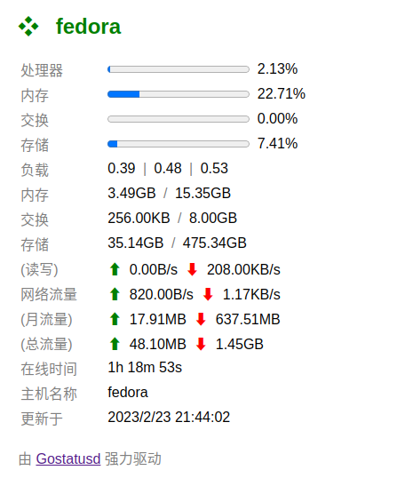

# Gostatusd

简单的服务器状态面板（支持月流量统计）



## 安装

直接 `make`，生成的二进制文件已包含全部内容。

## 使用

`./gostatusd -listen=监听地址 -record=自定义记录文件位置 -theme=自定义主题路径 `

参数如下：
- -listen 服务监听地址，默认为 ':9900',即IPv4/v6的9900端口
- -record 自定义月流量记录文件的位置，默认 '/tmp/gostatusd.json'
- -theme 自定义主题的zip路径，详细信息参见下一章节

## 自定义主题

编写网页，数据源为 `GET /stat`。数据格式解析如下：

```json
{
    "percent": { // 使用情况百分比
        "cpu": 0, // 处理器
        "mem": 23.42215831943398, // 内存
        "swap": 0.0030517592676922167, // 交换
        "disk": 7.412246001910917 // 存储
    },
    "load": { // 负载
        "load1": 0.49, // 1分钟内系统的平均负载
        "load5": 0.49, // 5分钟内系统的平均负载
        "load15": 0.52 // 15分钟内系统的平均负载
    },
    "memory": { // 内存使用情况
        "total": 16482992128, // 总字节数
        "used": 3860672512, // 已使用字节数
        "free": 1112956928 // 可用字节数
    },
    "swap": { // 交换区使用情况
        "total": 8589930496, // 总字节数
        "used": 262144,  // 已使用字节数
        "free": 8589668352 // 可用字节数
    },
    "disk": { // 存储使用情况
        "total": 510389125120, // 总字节数
        "used": 37725609984,  // 已使用字节数
        "free": 471237664768, // 可用字节数
        "read": 0, // 当前读写速度 (字节/秒)
        "write": 0 // 当前写入速度 (字节/秒)
    },
    "network": { // 网络情况
        "rx": 0, // 当前接受速度 (字节/秒)
        "tx": 0, // 当前发送速度 (字节/秒)
        "in": 1553412706, // 总接受字节数
        "out": 50627498, // 总发送字节数
        "min": 668507305, // 月接受字节数
        "mout": 18795622 // 月发送字节数
    },
    "uptime": 5111, // 在线时间（秒）
    "hostname": "fedora" // 主机名称
}

```

编写后，打包成zip文件，通过命令行参数 `-theme` 启用您的自定义主题。